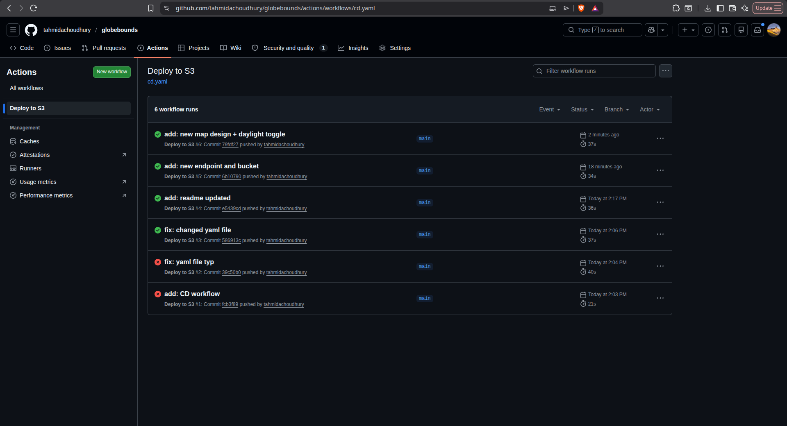
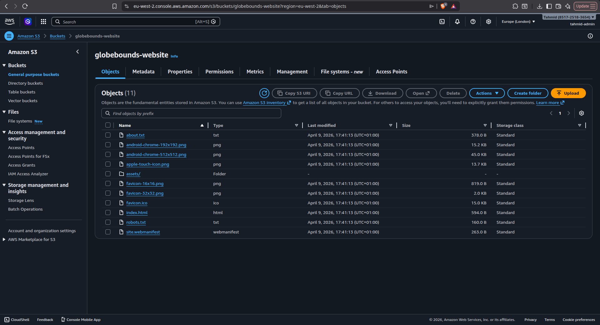

# GlobeBounds - CD Workflow Practice

## What Was Built

A GitHub Actions CD pipeline that automatically updates an S3 bucket with CloudFront enabled. On every push, the pipeline validates the code, builds the application with ESLint integrated and pushes it to AWS S3 with custom AWS actions and a least privelege IAM user - all without any manual steps.

## Pipeline Steps

1. Checkout code from the repo
2. Install dependencies
3. Build and lint the application
4. Sign in to AWS with a least privelege IAM user
5. Upload the `/dist` folder to S3 and delete what was previous

## What I Learned

- How to set up a GitHub Actions CD pipeline from scratch
- How CI/CD automatically catches bugs before they go anywhere
- How file structure affects where commands look for files

## Evidence

### Pipeline Passing

### Upload to S3 Bucket

### Static Site Hosted on Subdomain

